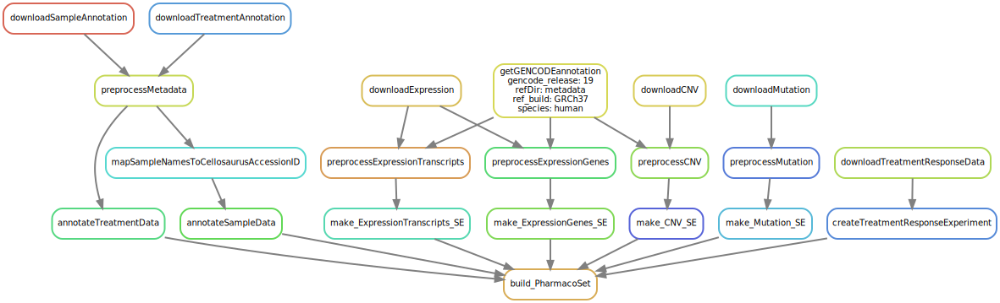

# This is the repository for the CCLE pipeline

This pipeline is considered `End-to-End` and will take you from downloading 
the raw data needed to a fully annotated dataset.

# Requirements
- [Snakemake](https://snakemake.readthedocs.io/en/stable/)


# Installation
```bash
git clone
cd CCLE
chmod u+x setup.sh
./setup.sh
```

# So far, the following has been implemented:
Create using 
```bash
snakemake -s workflow/Snakefile -F --dag | dot -Tsvg \
> resources/dag.svg
```




# Running the pipeline

### Annotate Metadata 

```bash
# Set your number of cores
NUMCORES=8
snakemake -s workflow/Snakefile --cores $NUMCORES annotateALLMetadata
```

# Data sources used:

NOTE: see `workflow/config/config.yaml` for the full list of data sources used
